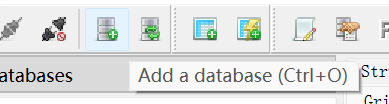
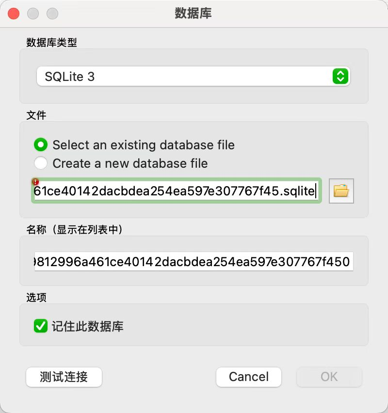
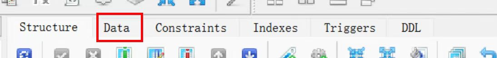

# WO CIAO Yoga  
**Author:** Deng Jianwei (ID: 10973015)

WO CIAO Yoga is a yoga learning and practice website built with **Vue 3** and **Nuxt 3**, offering features such as teacher profiles, course overviews, highlight recommendations, and a dynamic class schedule.

Live site: [https://yoga-782.pages.dev/](https://yoga-782.pages.dev/)

---

## Features

- **Home**
  - Display highlighted recommended courses
  - General overview and navigation links

- **Teacher**
  - View profiles of 9 yoga instructors
  - Includes biographies and course specialties

- **Activities**
  - Browse 10 themed yoga classes
  - Each course includes descriptions, highlights, and images

- **Schedule**
  - Visualized daily class timetable
  - Organized by time slots and instructors

- **Highlight Recommended**
  - Visually presents featured courses selected for promotion

---

## Tech Stack

| Layer        | Technology |
|--------------|------------|
| Frontend     | [Nuxt 3.17.4](https://nuxt.com/) |
| UI Framework | [Nuxt UI](https://ui.nuxt.com/) |
| Server Engine | [Nitro 2.11.12](https://nitro.unjs.io/) |
| Database     | [Cloudflare D1](https://developers.cloudflare.com/d1/) |
| ORM          | [Drizzle ORM](https://orm.drizzle.team/) |
| Deployment   | [Nuxthub](https://nuxthub.com/), [Cloudflare Pages](https://pages.cloudflare.com/) |

---

## Project Structure

yoga-main/
├── pages/ # Core route pages (e.g., /teacher, /activities, /schedule)
├── components/ # Reusable UI components (cards, layouts, etc.)
├── server/ # API routes and database interaction logic
├── assets/ # Static assets such as images or styles
├── layouts/ # Shared layout templates
├── public/ # Publicly served files (e.g., favicon)
├── utils/ # Utility functions
├── drizzle.config.ts # Drizzle ORM configuration
├── nuxt.config.ts # Nuxt project configuration
├── app.vue # Application entry point
├── *.csv # Static data files (teachers, events, schedule)
├── package.json # Project dependencies and metadata
└── README.md # Project documentation


---

## GitHub Repository

GitHub: [https://github.com/Simon0619/WO_CIAO_YOGA)](https://github.com/Simon0619/WO_CIAO_YOGA)

---

## Database Guide

This project uses **Cloudflare D1** as its database with schema and query management handled by **Drizzle ORM**.

### Tools:

- ORM: Drizzle
- Database engine: SQLite (for local development/backup)
- GUI tool: SQLiteStudio  
  Download: [SQLiteStudio 3.4.17](https://github.com/pawelsalawa/sqlitestudio/releases/download/3.4.17/SQLiteStudio-3.4.17-windows-x64-installer.exe)

### How to View Local Database (via SQLiteStudio):

1. Open SQLiteStudio  
2. Click **Add Database**  
   
3. Select your `.sqlite` file (This .sqlite does not exist by default. After the first npm run dev, it will be generated in the .data/hub/d1/miniflare-D1DatabaseObject folder)
   
4. Import CSV data to tables  
   

Steps:
- Right-click the database → `Import → Table from CSV file`
- Import the following:
  - `teachers.csv`
  - `events.csv`
  - `event_teachers.csv`
- Use the **Data** tab to browse content

### Data Tables (Overview):

| Table Name       | Description |
|------------------|-------------|
| `teachers`       | Stores teacher info (name, background, course expertise) |
| `events`         | Yoga courses and highlight events (title, intro, time) |
| `event_teachers` | Links teachers and courses (many-to-many relationships) |

Schema definitions can be found in:
- `/server/db/schema.ts`
- `drizzle.config.ts`

---

##  Getting Started (Local Development)

Make sure [Node.js (v18 or higher)](https://nodejs.org/) is installed.

```bash
# 1. Install dependencies
npm install

# 2. Start the development server
npm run dev


